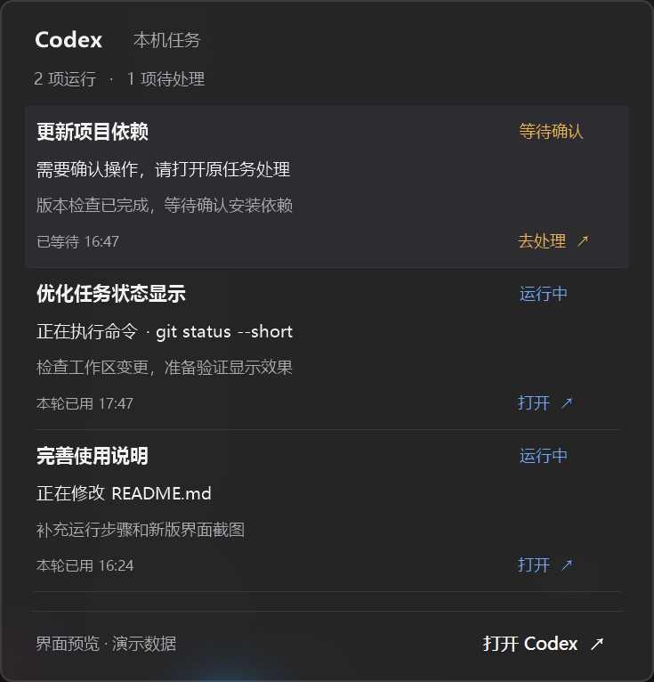

# Codex Peek

[](https://github.com/2cat/CodexPeek/actions/workflows/ci.yml)

Windows 11 上的本地 Codex 状态工具。在任务栏左侧空白区域显示当前工作状态和账号剩余额度，点击展开本机任务列表。

## 产品演示

任务栏左侧显示状态、剩余额度和重置倒计时：

<a href="docs/images/taskbar-demo.png"></a>

点击展开，查看并行任务的具体内容，优先处理等待确认的操作：

<a href="docs/images/tasks-demo.png"></a>

截图来自 Windows 11 上当前可运行的版本，任务和额度均为演示数据。使用系统原始分辨率的无损 PNG（560 × 70 / 735 × 766），点击图片可查看原图。

## 功能

- 单任务显示动作和当前内容，如「正在修改 App.cs」「命令 · git status --short」「工具 · 检查状态栏文字显示」。
- 回复时显示最新非空行的文字摘要，长行跟随最新片段更新；没有可用动作内容时显示任务名称，不停留在孤立的「正在整理回复」。
- 多任务显示运行数量；等待确认、等待回复和异常优先提示。
- 空闲时显示最近一次已同步任务的名称，断线时明确显示「状态未同步」。
- 额度显示剩余百分比及实际重置倒计时，例如「剩余 7% · 3天5小时后重置」。
- 点击查看每项任务的动作、最近进展和计时，再进入 Codex 原会话处理。
- 任务栏空间不足时收窄或退到托盘；不增加任务栏高度。
- 轻量状态点、系统字体与紧凑空闲面板；展开面板使用系统圆角、细边框和深色 Acrylic，透明效果不可用时使用实色背景。

这是独立开发的本地工具，与 OpenAI 官方产品无隶属关系。桌面任务接入使用 Codex 内部协议，升级后可能需要适配。

## 当前状态

当前 **320 × 40 DIP** 版本已在开发机的 Windows 11、175% 缩放下启动、显示并部署到日常入口。入口显示状态点，空闲弹窗缩至 160 DIP，有任务时保留每项任务的完整详情。

仓库源码、CI 测试通过与某台机器上允许启动需要分别确认。当前没有签名安装包或正式 Release。详见 [验证记录与已知限制](docs/validation.md)。

## 开发与运行

环境要求：

- Windows 11，系统 .NET Framework 4.x 编译器及 WinForms / UI Automation 程序集。
- Node.js 24 或更新版本；数据组件仅使用标准库，没有 npm 项目依赖。
- 已登录并运行的 Codex 桌面应用。
- 通过 npm 安装的 Codex CLI；额度读取目前从 `%APPDATA%\npm\node_modules\@openai\codex` 定位它。使用其他 npm 全局目录时需要适配路径。

在 PowerShell 中克隆和检查：

```powershell
git clone https://github.com/2cat/CodexPeek.git
cd CodexPeek
npm test
.\build.ps1
```

`build.ps1` 编译应用、运行数据测试和原生布局测试。产物位于 `dist/`，布局测试程序位于 `build/`，不会覆盖仓库根目录中可能保留的本机旧版 EXE。

只编译、不运行测试程序：

```powershell
.\build.ps1 -BuildOnly
```

构建后，保持 `dist/CodexPeek.exe`、`dist/backend.mjs`、`dist/status.mjs` 在同一目录，双击 `CodexPeek.exe`。程序以当前用户权限运行，不设置开机自启。部署新版本前退出旧实例；程序有单实例限制。

点击状态条展开详情，Escape 或点击其他窗口收起，右键状态条或托盘图标退出。开发机的项目根目录快捷方式已使用本次验证过的版本；拉取代码或构建不会自动替换你的日常程序。

## 代码与维护

| 文件 | 职责 |
| --- | --- |
| `App.cs`、`app.manifest` | C# WinForms 窗口、托盘、DPI、任务栏避让、会话跳转 |
| `backend.mjs` | 本机任务目录、桌面 IPC、额度请求、重连与生命周期 |
| `status.mjs` | 任务状态归纳、优先级、命令内容和剩余额度文案 |
| `test.mjs` | 数据规则及真实命名管道传输测试，使用隔离的测试数据 |
| `LayoutTests.cs` | 100% / 175% 缩放、图标避让和弹层边界检查 |
| `build.ps1` | 编译和测试，输出可一起复制的应用文件 |

[产品与接入说明](docs/design.md)记录显示规则和接口边界；[验证记录](docs/validation.md)记录已验证行为与待处理问题。

GitHub Actions 在 `main` 推送和 Pull Request 时执行 Windows 构建、数据测试和原生布局测试。它不连接开发者的 Codex 账号，也不执行真实桌面交互验收。更换最终 EXE 后，仍要在目标机器验证冷启动、操作、退出和再次启动。

EXE、快捷方式、构建目录、诊断文件及本机会话数据库不入库。修改功能时先在现有测试边界补充回归用例，验证后提交；生成文件留在 `dist/` 和 `build/`。
